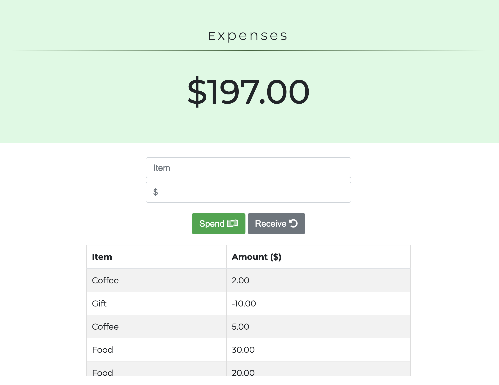
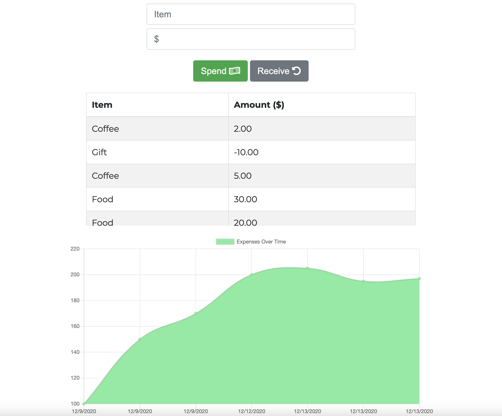

# Expense Tracker

## Deployed Application

[Expense Tracker](https://budgettracker-mh.herokuapp.com/)

## Description 

This full-stack web application allows users to keep track of a budget's expenses, and it allows a user to enter transactions while offline if running as a PWA.

When the user navigates to the homepage and the application is online, the history of expenses are output in table and chart form. The user will see the total expenses at the top of the page. When the user enters the name of an expense and the amount of money associated with that expense, the "spend" button can be pressed to add to the total expense, and the "receive" button can be pressed to subtract the total expense. When the user has a negative expense, this means there are extra funds, and the total will therefore have a "+" sign before the output.

This application stores user data in MongoDB Atlas while online, but it can be run locally without an internet connection (as well as being installed as a PWA) and store transactions in the browser's IndexedDB. When internet connection is back on, those transactions stored in IndexedDB will be sent to MongoDB, and future output will include those transactions while made offline.

## Features

* Node.js back end with Express routing. 
* Manifest.json and service-worker.js provide PWA functionality.
* Front-end written in JavaScript.
* Takes advantage of JavaScript Fetch API.
* MongoDB/Mongoose stores and retrieves transactions while online. 
* While offline, IndexedDB keeps track of transactions.
* Chart.js library provides tools needed for data charts.
* Incorporates Bootstrap for styling. 

## Credits

Michael Hanson
* michaeledwardhanson@gmail.com
* [GitHub](https://github.com/mhans003)
* [LinkedIn](https://www.linkedin.com/in/michaeledwardhanson/)

## License 

Licensed under the [MIT License](./LICENSE.txt).